# Pixel line rules: lines that look drawn on an old monochrome LCD

Status: spike result, 2026-10-05. Code: `prototypes/street-zoom` (`src/core/artLine.ts`, `src/gl/pixelPass.ts`, `src/style/monoStyle.ts`). Builds on `docs/street-zoom-spike.md` (the pixel pass) and `docs/design-tokens.md` (colours). This is the spec a production port must follow; section 6 lists what to test.

## 1. Problem and measured root cause

Owner's report: certain lines disappear in certain places, and lines look like a high-resolution image that was downscaled, not like pixels on a coarse grid.

The spike's pass drew lines at their nominal CSS width (0.6 px for coastlines, buildings and minor roads; 1 px for the rest), anti-aliased by MapLibre, then **max-pooled** each art cell (3 CSS px) and thresholded at 0.5. Two things go wrong, and which one you see depends on the screen:

| Where | What happens | Measured (synthetic polylines: 24 angles x 16 sub-pixel offsets x 3 zooms, 384 lines per row) |
|---|---|---|
| DPR 1 (a 0.6 px line is below one device pixel) | The anti-aliased peak coverage of a hairline is often below the 0.5 threshold in a given cell, so the line breaks into pieces or loses its ends | minor roads: **9.6 %** of polylines broken, 2.1 % lose an end; building outlines: **32.8 %** broken, 5.5 % lose an end; dotted minor roads: 4.7 % of angle/offset combinations have no ink at all |
| DPR 2 (the same line is 1.2 device px) | The footprint max-pool always finds ink, but one line touches two cells across, so it doubles | **86.5 %** of minor roads are thicker than 1.25 cells per step (mean 1.45 cells per step, up to 2.1) |
| Real map, DPR 1 | Fragments | buildings at z17.5: 43 components vs 25 in the native raster (1.54x); water edge at z14.5: 37 vs 19 (1.95x) |
| Real map, DPR 2 | Thickness doubling | minor roads 1.43x the ink of a native raster, buildings 1.34x, 2x2 blocks in 15.6 % of minor-road and building ink |

The root cause is therefore **the rule, not the resolution**: a width that is not tied to the art pixel, plus an area-based decision (max over a footprint) that is a function of anti-aliasing coverage. A line is native to the grid only if the decision is a point sample (is the centre of this cell inside the line?) and the width is at least one art pixel.

Environment of every number below: Apple M4, Chrome for Testing 153 headless (ANGLE Metal), Protomaps HCMC extract, 800x560 viewport, art cell 3 CSS px (3 device px at DPR 1, 6 at DPR 2), `theme=light`, production style, all runs reproduced from `scripts/`. Real-map views: z12.8, z14.5, z16.5, z17.5 around Ho Chi Minh City.

## 2. Candidates compared

All variants share the same harness (`scripts/line-integrity.mjs`, `scripts/synthetic.mjs`, `scripts/measure.mjs`). Query flags select a variant (`?rule=...&widths=...&thin=...`).

| | Variant | Idea |
|---|---|---|
| 0 | legacy | nominal widths, max-pool, threshold 0.5 (the spike) |
| A | native art-resolution render | the map is rendered at 1/3 scale (one source pixel per art cell, MapLibre antialiasing has nothing to blur), widths in art px (floor 1), threshold only (`comp=copy-art&scale=0.3333&rule=centre`) |
| B | supersample + conservative coverage | max-pool at full resolution with a low threshold (`rule=any`), nominal widths (B) or art widths (B2) |
| C | B + thinning | `any` followed by thinning so lines return to 1 px: Zhang-Suen (C) or a 4-connected staircase remover (C2) |
| E | centre sampling | widths in art px with a floor of one, the cell is ink iff its **centre** is inside the line (`rule=centre`) |
| **F** | **E + staircase removal (chosen)** | E, then remove the redundant corner of every two-cell step, so a diagonal is exactly one cell per step and stays 8-connected |
| R | ridge | tent-profile hairlines with non-maximum suppression (`rule=ridge`) |
| D | snap line geometry to the art grid in the vertex stage | **not built**: MapLibre has no vertex hook, it needs its own line tessellation (or a custom layer). F already reaches Bresenham density, so D could only buy exact positions, not integrity |

Numbers (Chrome, M4). Columns: **broken** = polylines that are not exactly one 8-connected component (synthetic, DPR 1, road-minor and building-outline rows); **doubled** = polylines above 1.25 cells per major-axis step (DPR 1 / DPR 2); **cells/step** = mean (min-max) at DPR 2; **line missing** = share of cells touched by reference ink with no output ink within one cell (real map, DPR 2, 4 views x 5 classes); **2x2 blocks** = share of ink inside fully inked 2x2 blocks (minor roads and buildings, DPR 2); **pan** = changed cells per frame during a slow pan of 0.25 art px per frame, over the ideal (native raster), mean (max) of 8 runs; **reversals** = cells that flip on, off, on again over three frames. Cost = GPU-synced ms p50, street view, 1440x900 at DPR 2, median of 3 sessions.

| | broken | doubled | cells/step | line missing | 2x2 blocks | pan | reversals | cost | dotted lines with no ink |
|---|---|---|---|---|---|---|---|---|---|
| 0 legacy | 9.6 % / 32.8 % | 34.6 % / 86.5 % | 1.45 (1.17-2.11) | 0.01 % | 15.6 % | 0.92 (1.01) | 0.25 % | 7.0 (pass 1.04) | 2.3 % to 4.7 % |
| B any, nominal | 0 | 76.6 % / 97.1 % | 1.54 | 0.00 % | 31.3 % | 0.91 (1.01) | 0.24 % | not measured | 2.3 % |
| B2 any, art widths | 0 | 100 % / 100 % | 2.32 | 0.00 % | 98.5 % | 0.91 (0.96) | 0.14 % | not measured | 0 |
| C any + Zhang-Suen | 0 | 0 | 0.92 | **4.73 %** | 0.4 % | **1.39 (1.94)** | **4.7 %** | not measured | 0.5 % |
| C2 any + staircase | 0 | 68 % / 93 % | 1.53 | 0.00 % | 30.3 % | 1.18 (1.74) | 3.35 % | 6.7 | 0 |
| E centre | 0 | 5 % / 5 % | 1.06 (0.91-1.42) | 0.03 % | 4.1 % | 1.00 (1.02) | 0.12 % | not measured | 0 |
| **F centre + staircase** | **0** | **0 / 0** | **0.96 (0.90-1.05)** | **0.06 %** | **0.5 %** | **1.04 (1.07)** | **0.55 %** | **6.5 (pass 1.04)**; 5.3 at map scale 1 | **0** |
| A native render, centre | 0 | 6.0 % / 6.0 % | 1.08 | 0.07 % | 6.4 % | 0.98 (1.01) | 0.09 % | 2.6 (pass 0.30) | 0.5 % |
| A2 native render + staircase | 0 | 0 / 0 | 0.96 | 0.11 % | 1.1 % | 1.03 (1.05) | 0.62 % | **2.8 (pass 0.40)** | 0.5 % |
| R ridge | 74 % to 79 % | 0 | 0.90 (0.70-1.05) | not run | not run | not run | not run | 4.8 at map scale 1 | 0 |

For the reference, the native raster itself has a reversal rate of 0.22 % under this pan: rasterising a moving line on a grid flickers a little by nature. "Pan 1.0" means exactly as stable as that ideal.

Reading the table:

- **Dropout.** Counting every touched cell as a miss (the strict definition: reference ink in the footprint, none in the output) is the right measure for area fills, and the old rule scored 6.6 % (DPR 2) and 16.2 % (DPR 1). It is the wrong measure for a 1 px line, because a line cannot cover every cell it grazes; any rule that makes lines one pixel wide scores 40 % to 60 % on it (F: 55.0 % at DPR 2, 56.8 % at DPR 1). For lines the correct definitions are **no output ink within one cell of reference ink** (the "line missing" column) and **connectivity** (the "broken" column). Variants B, B2 and C2 hit 0 on both but double the line; the centre rule hits 0 on both without doubling.
- **B and B2** never drop a line but double it, by construction: conservative coverage and thin lines are opposites.
- **C (Zhang-Suen)** is the textbook "supersample, then thin", and it fails the stability test: thinning is order-dependent, so under pan the skeleton shimmers (reversals 4.7 %, pan 1.39, up to 1.94) and it cuts real lines (line missing 4.7 %).
- **C2** keeps connectivity but thinning a thick (any) mask leaves 2-cell steps.
- **E** is native rasterisation. Its only defect is geometric: at some angles a 1 px line sampled at cell centres is 4-connected with an extra corner cell per step (5 % of lines above 1.25 cells per step, worst case 1.42).
- **F** removes exactly those corners (two sub-passes, left then right corners, never both neighbours of a step), so every one-pixel line is 0.90 to 1.05 cells per step, i.e. a Bresenham line.
- **A** gets the same look more cheaply (2.6 ms against 6.5 ms, DPR independent: DPR 1 and DPR 2 give identical numbers), but the sharp reveal and the dissolve need a device-resolution source to show the hairline detail, and its dashed lines still lose ink in 0.5 % of angle/offset combinations because dashes are rasterised at 1/3 scale. A2 is the right choice for a phone without the reveal.
- **R** needs tent-profile lines and fails on MapLibre's flat-profile lines: 74 % to 79 % broken.

## 3. The rules (what a production port must do)

### 3.1 Art grid

1. One art pixel is a whole number of device pixels (`cellDevicePx`: round(3 CSS px x DPR), min 1; 2 CSS px below 520 px). Cells are square and aligned to the viewport origin; nothing in the art image is ever fractional or rotated.
2. Everything the user sees in the pixel area is a lookup in the art image with nearest sampling.

### 3.2 Widths

1. Every line width is authored in **art pixels** and floored at **1.0**. Nothing is thinner than one art pixel; there are no hairlines (the spike's 0.6 px widths are gone).
2. The map style multiplies by the actual cell size (in CSS px) at paint time: `line-width = art_width x cellCss`. When the cell size changes (viewport crossing 520 px, DPR change) the widths are re-applied.
3. Ramps (art px): major roads 1 at z5, 1.3 at z12, 1.6 at z14, 2 at z15, 3.2 at z16, 5.6 at z17, 10 at z18; medium roads 1 at z12 up to 8.9 at z18; rivers 1 to 2.9; rail 1.8 muted; coast, borders, graticule exactly 1. See `MAJOR_ART`, `MED_ART` in `monoStyle.ts`.

### 3.3 Coverage rule (pass A)

1. Sample the plain-colour render at the **exact centre** of the cell. If the ink channel R exceeds the threshold `0.49 x 0.75`, the cell is ink. Threshold only: no max-pool, no area coverage, no blend. With width >= 1 art px this never drops a line (a band at least one cell wide contains at least one cell centre in every row or column it crosses).
2. Antialiasing of the source is irrelevant and may be on or off.
3. Ink strength is the class code. A line meant to be one pixel wide is painted at R = 0.75 (`THIN_INK`), a wide line at R = 1. The pass writes a class per cell: none, thin ink, solid ink, tone, muted.

### 3.4 Thinning (pass T)

1. One iteration (two sub-passes) of staircase removal on **thin ink cells only**: a cell is removed when it is the corner of a two-cell step (exactly one horizontal and one vertical ink neighbour, the diagonal continues, and its removal orphans no neighbour). Solid ink (wide roads, filled hollow-road rims) is never thinned.
2. Result: every one-pixel line is 8-connected with one cell per step along its major axis. No 2-pixel doubles, no L-corners.
3. Do **not** use skeleton thinning (Zhang-Suen): it shimmers under pan and breaks lines.

### 3.5 Hollow roads

A road is hollow only when its casing is at least **4 art px** (two 1-pixel outlines + a 2 px interior). From that zoom the casing is two one-pixel outlines and the erasing interior is `casing - 2`, with a minimum of 2. Below it the road is one solid line. Hollow main roads and the medium roads keep their look (screenshot `line-hollow-z17.2`).

### 3.6 Dotted and dashed lines

Minor tracks, paths, canals, region borders and the 3-to-3.3 zoom border band are **1 px ink dashes** along the line, never a tone dithered by the Bayer matrix (the old look was a dither wash that made lines vanish at some angles). Dash arrays are in line widths, which are art pixels: minor road `[1.8, 2.4]`, other roads and paths `[1.8, 3.6]`, canal `[6, 1.5]`, region border `[4, 1.5]`, graticule `[1.5, 2.5]`. Measured: zero polylines without ink at any angle or offset, 0.26 to 1.0 cells per step.

### 3.7 Pattern fills (parks, water, buildings)

1. Fills are a function of the **screen cell and the tone only**: `lit = bayer8(cell) < round(tone x 16) x 4` (the "clean" style: tone quantised to sixteenths, so the Bayer thresholds trace regular dot lattices: 1/16 one dot per 4x4, 1/4 every other pixel, 1/2 a checkerboard). It never depends on world coordinates, zoom or time.
2. Because of that, the interior of a fill is static under pan and zoom: **0 cells change inside fills** over a 12-frame pan at z12.8 (measured). The cost is the shower-door effect (the stipple sticks to the glass while the map moves under it), which is the behaviour of a real LCD and is the deliberate choice.
3. The busy park stipple of the spike is replaced by the regular lattice, and the grey hatched band across `streets-z14.png` (it is the rail line, which used to be a tone dithered at 0.8: 6 rail features in that view) is drawn as a solid 1.8 px muted line. Compare `line-streets-z14-before.png` and `line-streets-z14-after.png`.

### 3.8 Motion stability

Pan by 0.25 art px per frame: the number of cells that change per frame must be within **1.15x** the native raster's (measured 1.00 to 1.07 for F), and cells that flip on-off-on within three frames below **3 %** (measured 0.55 %). A line moves as a whole: no flicker in the interior of a segment, only the unavoidable step at a cell boundary.

### 3.9 Colours (tokens)

The pass only knows three colours, read from the CSS tokens: `--background`, `--foreground`, and `--globe-limb` composited over `--background` for muted lines (rail, graticule, the globe limb). No other colour, no grey ramp. The only grey the user sees is muted and it is a flat colour, not a mix. Light and dark use the same code path.

### 3.10 Reveal and dissolve

The sharp reveal and the dither dissolve are unchanged: cell by cell, a cell is replaced by the sharp source render when the focus mask (or the global dissolve) exceeds its Bayer threshold. One-pixel lines are painted at 0.75, so the sharp image divides by 0.75 to draw them at full strength. A revealed cell never flickers back.

### 3.11 Cost and idle

Idle is zero frames (0 renders, 0 rAF calls, 0 pass runs over 1.5 s, asserted in the regression script). Pass A + T costs 1.0 ms at 2880x1800 on the M4 (isolated pass time is the same as the old rule's, 1.04 ms: at DPR 2 the centre rule reads 5 texels per cell instead of the 36 of the max-pool, and the saving pays for the staircase pass). Rendering the map at scale 1 instead of DPR (a free parameter of the compositor) takes the synced frame from 6.5 to 5.3 ms.

### 3.12 Level of detail (production style)

Added with the street style's LOD (`apps/web/app/globe/street/style/lod.ts`, `docs/street-architecture.md`). Rules that follow from the above: (a) a class that fades in with zoom is drawn in the TONE channel (screen-anchored lattice, tone climbing 0 to 1) and swaps to hard ink at its `full` zoom; the swap only removes stair corners. (b) A thin-class line must be exactly 1 art px wide: widths in (1, 1.6) make it two cells wide at some offsets, so ramps jump from 1 to at least 1.6 (main roads: 1 to z14.6, 1.7 at z15.2). (c) Lighter classes keep a dashed ink pattern (dash at least 1.42 line widths) instead of a smaller width. (d) At tone 1/2 the lattice is a checkerboard, so a 45 degree line can show only one parity of its cells for a short zoom span; this is the one transient where a ramping line is thinner than 8-connected, and it never applies to fully-on lines. The rail is a dashed ink line now (was a solid muted 1.8 px line, 3.3 and 5).

## 4. Before and after

Crops of 380x240 CSS px, 2x, light theme unless noted, 16-colour PNGs. The first pair is the clearest test: 48 identical building outlines at 24 angles on a DPR 1 screen.

| Before (spike) | After |
|---|---|
| 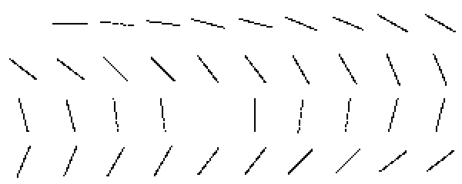 | 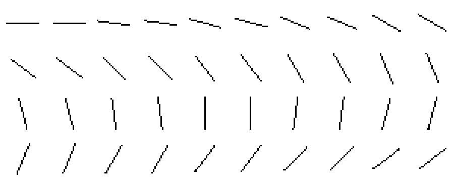 |
| 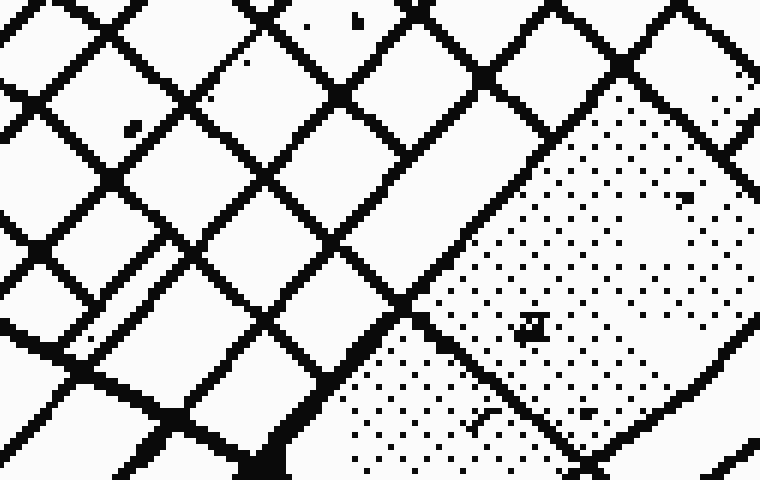 | 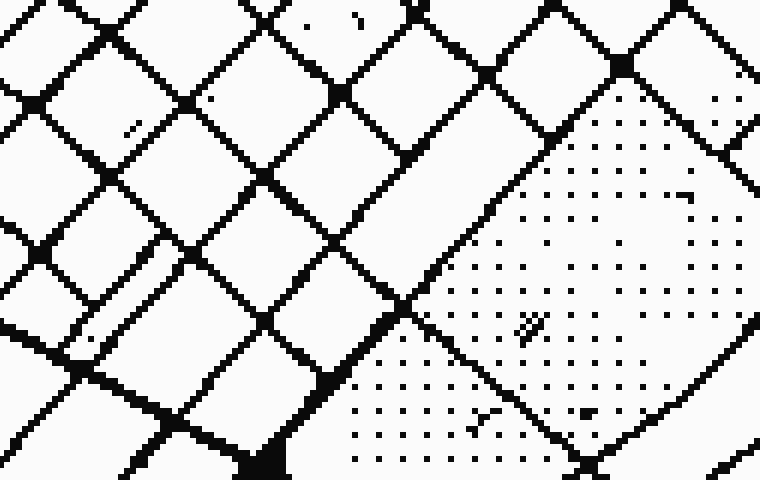 |
| 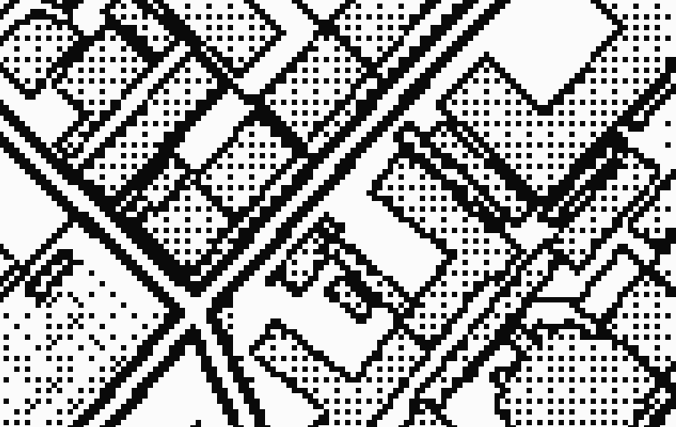 | 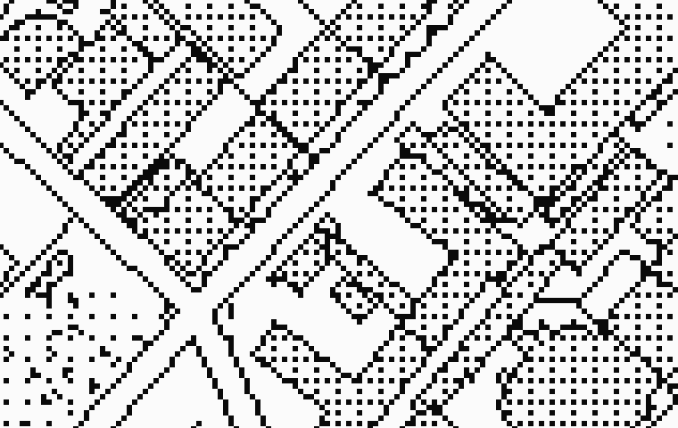 |
| 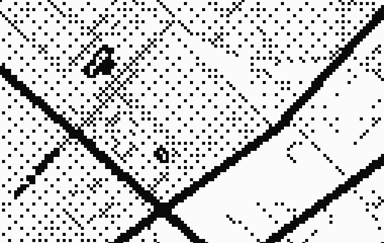 | 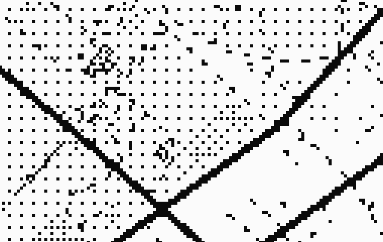 |
| 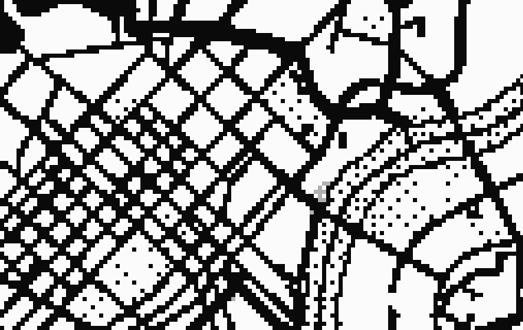 | 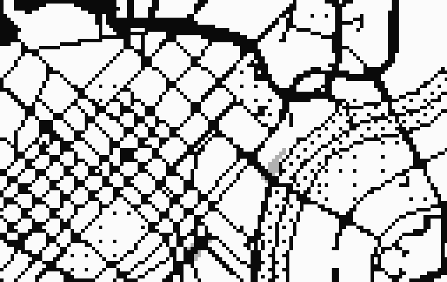 |
| 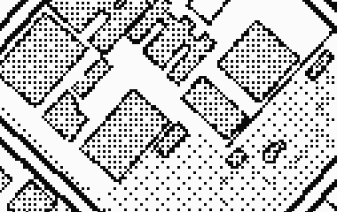 | 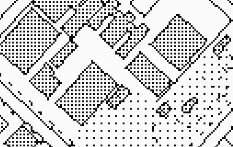 |
| 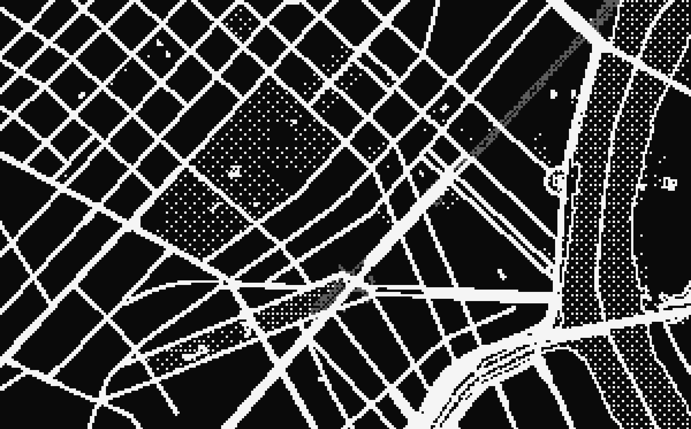 | 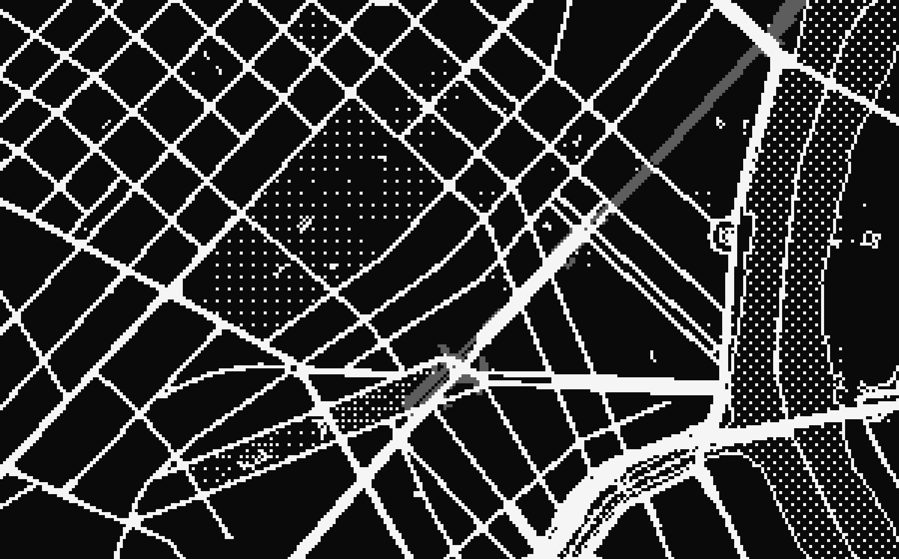 |

DPR 2 versions of the fan are `line-fan-before-dpr2.png` and `line-fan-after-dpr2.png`.

## 5. Known artefacts

- The dotted minor roads read as sparse dashes at z15 to 16 in dense blocks; their density varies by angle (0.26 to 1.0 cells per step, a 4x spread, limit in the test) because the dash phase runs along the line, not along the grid.
- The rail line is 1.8 art px and is not thinned: its width alternates between 1 and 2 cells along a diagonal.
- The stipple sticks to the screen while panning (shower door), by design, see 3.7.
- Staircase removal costs about 4 % to 5 % of the cells of the native raster (the corners it removes) at the price of 8-connected one-pixel lines.
- Fills are measured only through their churn under pan, not for look: the building fill and the park stipple are still the spike's tones.
- Measured on one machine (M4, headless). Costs are not phone data. Motion was measured at DPR 2 only; connectivity at DPR 1, 1.5 and 2 (synthetic) and DPR 1 and 2 (real map).

## 6. What to test in the production port

`pnpm --filter @catalyst/prototype-street-zoom test:lines` (starts `vite` on :5190, needs `public/hcmc.pmtiles` and Chrome for Testing; `test:lines:quick` runs only the synthetic part in about 30 s without the extract). It exits 1 on any violation, so it can run in CI. The current code passes 211 of 211 checks; the legacy rule fails 108 of them (negative control, `--query="rule=legacy&widths=legacy&pattern=bayer8"`).

| Check | Limit | F measured |
|---|---|---|
| Synthetic polylines (24 angles x 16 offsets x 3 zooms, DPR 1, 1.5, 2): not exactly the expected number of components | 0 | 0 |
| ... end not covered / doubled (> 1.25 cells per step) / thin (< 0.85) | 0.5 % each | 0 / 0 / 0 |
| Hollow roads (z17.5): two outlines, cells per step | <= 2.6 | 2.05 |
| Dotted lines with no ink at all; lowest cells per step; max/min density | 0; >= 0.2; <= 4 | 0; 0.26; 3.8 |
| Real map, per class and zoom: ideal cells with no output ink within one cell | <= 0.2 % | 0 (all 18 rows) |
| ... extra connected components over the native raster | <= 15 % + 2 | 0 (all 18 rows) |
| ... one-pixel classes: output ink over native raster | <= 1.1 | 0.999 to 1.013 |
| ... minor roads and buildings: ink in 2x2 blocks | <= 6 % | 0 to 1.4 % |
| Pan: changed cells per frame vs native (same thinning) and vs plain native | <= 1.15 | 0.96 to 0.99 / 1.01 to 1.02 |
| Pan: reversals (z14.5 and z16.5; the table above averages 4 views and 2 directions) | <= 3 % | 0.16 % to 0.26 % |
| Cells that change inside fills during a pan | 0 | 0 |
| Idle renders and rAF calls | 0 | 0 |

Unit tests (pure logic, `pnpm --filter @catalyst/prototype-street-zoom test`): width ramps and the 1 px floor, the hollow-interior derivation, the reference rasteriser, 8-connected components, staircase removal (stairs become one cell per step and never disconnect a line), Bayer and "clean" tone patterns, the style-level invariants (no line layer below one art pixel, every dashed line in ink, hollow casings).

A production port should additionally run the synthetic check on its own engine (any engine that can draw a polyline in a plain colour into a canvas works: the pass only needs the red channel), on the real device matrix (DPR 1, 1.5, 2, 3) and with the OS zoom levels.
